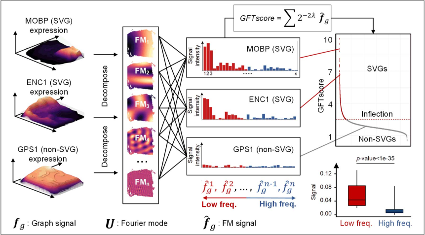

# About
```SpaGFT``` is a python package to process spatial transcript omics data by
graph Fourier transform. 

Given count matrix of spatial transcriptomics data and corresponding spatial
coordinate information, _SpaGFT_ transfer gene expression from spatial domain
to frequency domain (also called spectral main), i.e. finding a new representation
method for genes which combined gene expression and spatial information 
simultaneously. _SpaGFT_ can identify spatially variable genes, detect tissue 
modules, enhance gene expression.



## SpaGFT's functions
- Detect spatially variable genes.

- Identify tissue modules.

- Impute gene expression.

## SpaGFT’s features
- Hypothesis-free. _SpaGFT_ do not assume gene expressions obey any distributions
or generated from some certain techniques. It can work normally on all spatial
transcriptomics data due to the pure data-driven character.

- Running efficiently. _SpaGFT_ can run on PC directly and is running fast. For 
usually Visium data, only a few seconds are consumed to detect spatially 
variable genes. Besides, even for larger datasets, such as Slide-seq data and 
HDST data, _SpaGFT_ can still obtain results in a shorter period of time.

- Bridging gene levels information with tissue level information. By identifying 
spatially variable genes with similar spatial patterns in frequency domain, 
_SpaGFT_ identifying tissue modules and can interpret them by molecular functions.
