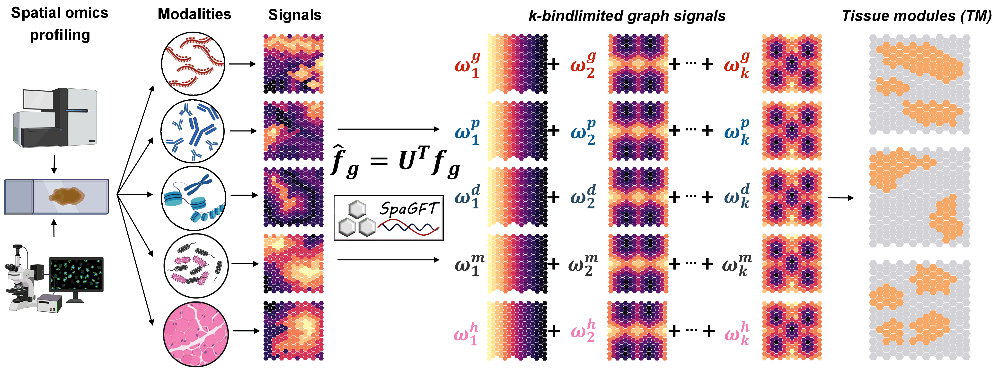

## About
```SpaGFT``` is a python package to analyze tissue functions empowered using spatial omcis data. 

Given the raw count matrix of spatial transcriptomics data and corresponding spatial coordinate information, _SpaGFT_ transforms grapg gene expression
to frequency domain (also called spectral domain), i.e., finding a new topological feature representation
method of genes which combined gene expression and spatial information of spots
simultaneously. _SpaGFT_ can transform complex spatial patterns into one-dimensional, simple but informative Fourier Coefficients (FCs). In this way, several tasks can be achieved by analyzing FCs, include identifying spatially variable genes (SVG), detecting tissue modules (TM), and enhancing gene expression.



### SpaGFT's functions
- Transform gene expression to FCs.

- Identify spatially variable features, including but not limited to genes and proteins.

- Characterize TM.

- Enhance spatial signals (e.g., gene expression).

### SpaGFT's advantages
- Hypothesis-free. _SpaGFT_ is a hypothesis-free graph Fourier transform framework (GFT) for SVG and TM identification from spatial transcriptomics data without assuming any spatial distribution patterns. 

- Computational effectiveness and efficiency. _SpaGFT_ can run on PC directly and still keep high accuracy and efficiency (time complexity is O(n^2)). For Visium data, it will take ~20 seconds to identify spatially variable genes. 

- Characterizing TM from a gene-centric perspective. By selecting and grouping the low-frequency FCs, SVGs with similar spatial patterns will be grouped into one cluster and form TM. Due to TM-associated SVGs, the gene signatures and biological functions of characterized TM can be further studied.

- SpaGFT can be also used for sequencing-based and imaging-based spatial transcriptomics, spatial-CITE-seq, and spatial proteomics.
