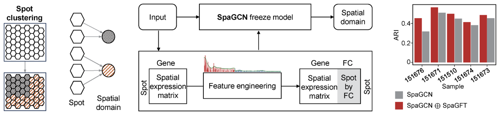
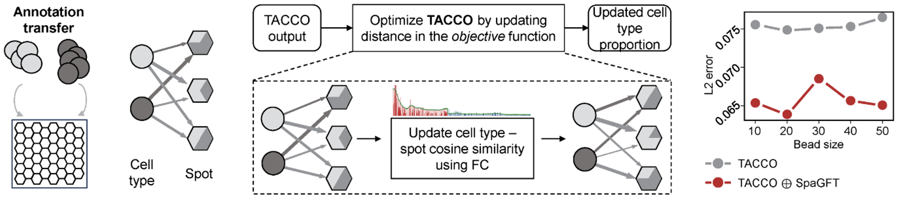
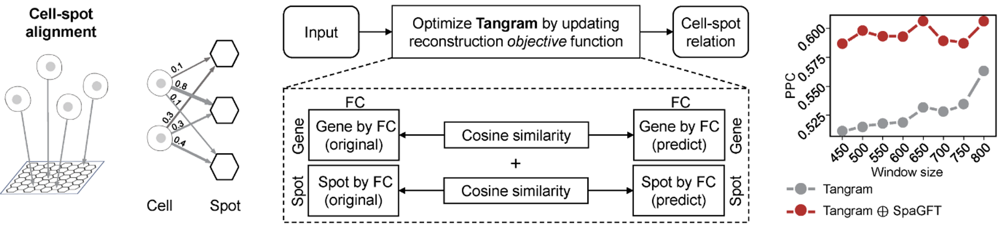
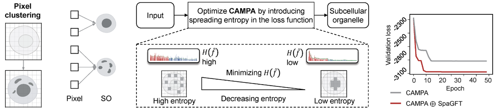

## Machine Learning Model Improvement

In this case, we will show the applications of SpaGFT into machine learning model improvement.

### Outline

1. SpaGCN Improvement
2. TACCO Improvement
3. Tangram Improvement
4. CAMPA Improvement

These implementations demonstrate the integration of SpaGFT into existing computational methods, enhancing their performance in their focusing, like analyzing spatial transcriptomics and subcellular organelle data. Each section of this guide focuses on a different framework, outlining the specific steps and methodologies employed to integrate SpaGFT. The guide is structured as follows:

### 1. SpaGCN Improvement

 
- Regarding the modified workflow of SpaGCN, we changed the original input of SpaGCN.  In addition to the spatial expression matrix with rows representing spots and columns representing cells, we compute the spot-spot similarity and apply SpaGFT to form a spot-by-FC matrix. This can be interpreted as project spot-spot similarity in the frequency domain. Following this, we concatenated the original expression matrix and the spot by FC matrix to generate a new input matrix. This newly formed matrix was then placed into the frozen SpaGCN model for computation. The top 5 performance-increased samples are distinctly showcased, where the y-axis is the ARI value, and the x-axis is the sample number.
- More details can be found at [GitHub](https://github.com/jxLiu-bio/SpaGFTModifiedSpaGCN) of SpaGFT-modified SpaGCN

### 2. TACCO Improvement

 
- Regarding the modified workflow of TACCO, we made modifications to the cost matrix in optimal transport. Originally, the cost matrix was calculated using genes as features to measure the cosine similarity between CT and spots, thereby measuring the distance from cell to spot. In the new cost matrix calculation method, we use weighted FCs as the feature to calculate the distance between CT and spots and then optimize the baseline mapping matrix (e.g., TACCO output). In the evaluation, we refer to TACCO methods to simulate spots with different bead sizes using scRNA-seq data and use L2 error to measure differences between predicted and known cell composition in each simulated spot. The y-axis is the bead size for a simulation data value, and the x-axis is the L2 error. 
- More details can be found at [GitHub](https://github.com/jiangyi01/SpaGFTModifiedTACCO) of SpaGFT-modified TACCO

### 3. Tangram Improvement

 
- Regarding the modified workflow of Tangram, we have added two additional constraint terms to the original objective function of Tangram. The first constraint is designed from a gene-centric perspective, calculating the cosine similarity of the gene by FC matrix between the reconstructed and the original matrix. The second constraint is designed from a cell-centric perspective, calculating the cosine similarity on the spot by the FC matrix between the reconstructed and the original matrix. In the evaluation, we first refer to the previous studies' method to simulate spatial gene expression data using different window sizes based on STARmap data. Subsequently, we measure the similarity between predicted and known cell proportions in each simulated spot using the Pearson correlation coefficient
- More details can be found at [GitHub](https://github.com/jxLiu-bio/SpaGFTModifiedTangram) of SpaGFT-modified Tangram

### 4. CAMPA Improvement

 
- Regarding the modified workflow of CAMPA, we have made a modification to the original loss function. The modified term aims to measure the spreading of graph signals in the reconstructed image. In the frequency domain, this spreading can be quantified using spreading entropy. A spreading graph signal corresponds to high entropy, while a non-spread graph signal corresponds to low entropy. Therefore, the new regularizer term aims to minimize the spreading entropy. In the evaluation, we use the validation loss, which was calculated using the same loss function and validation dataset to examine the contribution of the spreading entropy to the model training. The y-axis is the validation loss value, and the x-axis is the number of epochs for training the CAMPA model
- More details can be found at [GitHub](https://github.com/jiangyi01/SpaGFTModifiedCAMPA) of SpaGFT-modified CAMPA
