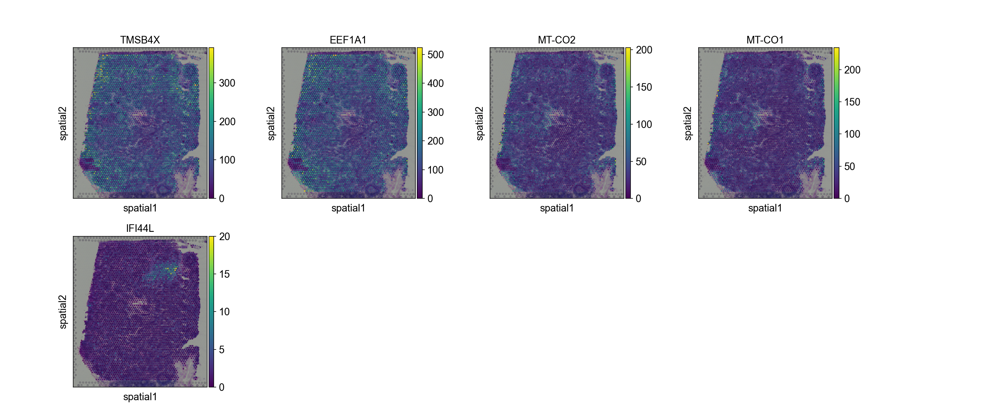

<h1><center>SpaGFT Tutorial</center></h1>
<center>SpaGFT is a python package to process spatial transcript omics data by graph Fourier transform.

## Outline
1. [Installation](https://github.com/jxLiu-bio/SpaGFT/blob/master/source/Toturial.md#1-Installation)
2. [Loading packages](https://github.com/jxLiu-bio/SpaGFT/blob/master/source/Toturial.md#2-Loading-packages)
3. [Loading Visium data](https://github.com/jxLiu-bio/SpaGFT/blob/master/source/Toturial.md#3-Loading-Visium-data)
4. [QC and preprocessing](https://github.com/jxLiu-bio/SpaGFT/blob/master/source/Toturial.md#4-QC-and-preprocessing)
5. [Find Spatially variable genes](https://github.com/jxLiu-bio/SpaGFT/blob/master/source/Toturial.md#5-Find-Spatially-variable-genes)
6. [Detect tissue module](https://github.com/jxLiu-bio/SpaGFT/blob/master/source/Toturial.md#6-Detect-tissue-module)
<br>


### 1. Installation

SpaGFT is a python package to analysis spatial transcriptomics data. To install SpaGFT, the python version is requried to >= 3.7. You can check your python version by:
```python
import platform
platform.python_version()
```
    '3.8.8'
We recommend you create a virtual environment for running SpaGFT. You achieve this by conda easily:
```python
conda create -n spagft python==3.8.0
conda activate spgft
```
If you want to exit this virtual envrionment, just run:
```python
conda deactivate
```
Next, install SpaGFT by:
```python
git colne url
cd dir
conda install requiremnt.txt
python3 setup.py build
python3 setup.py install
```


### 2. Loading packages

```python
import numpy as np
import pandas as pd
import matplotlib.pyplot as plt
import scanpy as sc
import SpaGFT as spg
import scanpy as sc
import seaborn as sns

sc.settings.verbosity = 3      
sc.logging.print_header()
sc.settings.set_figure_params(dpi=80, facecolor='white')
```
    scanpy==1.9.1 anndata==0.8.0 umap==0.5.3 numpy==1.21.5 scipy==1.8.0 pandas==1.4.2 scikit-learn==1.0.2 statsmodels==0.13.2 python-igraph==0.9.10 louvain==0.7.1 pynndescent==0.5.6

Define where save the results:
```python
results_folder = './results/lymph_nodes_analysis/'
```

### 3. Loading Visium data

In this tutorial, we choosed lymph node Visium data generated by 10X, which could be download easily for analysis. For your personal datasets, just load data to _AnnData_ object. Note that, two parts are essential, count matrix and spatial information, which need to be found by _adata.X_ and _adata.obs_(or _adata.obsm_) respectively.

```python
adata = sc.datasets.visium_sge(sample_id="V1_Human_Lymph_Node")
adata.var_names_make_unique()
adata.raw = adata
```

    reading /users/PCON0022/jxliu/scripts/python/SpaGFT/SpaGFT/source/spatial/data/V1_Human_Lymph_Node/filtered_feature_bc_matrix.h5
     (0:00:01)
    

###4. QC and preprocessing

We proceed to normalize Visium counts data with the built-in normalize_total method from Scanpy and filter genes which express less than 1o spots.


```python
sc.pp.filter_genes(adata, min_cells=10)
sc.pp.normalize_total(adata, inplace=True)
sc.pp.log1p(adata)
```

    filtered out 16788 genes that are detected in less than 10 cells
    normalizing counts per cell
        finished (0:00:00)
    

###5. Find Spatially variable genes


```python
gene_df = spg.rank_gene_smooth(adata,
                                ratio_low_freq=0.5,
                                ratio_high_freq=3,
                                ratio_neighbors=1,
                                filter_peaks=True,
                                spatial_info=['array_row', 'array_col'],
                                normalize_lap=False)
```

    Graph Fourier Transform finished!
    SVG ranking could be found in adata.obs['Rank']
    The spatially variable genes judged by gft_score could be found in adata.obs['cutoff_gft_score']
    Gene signals in frequency domain could be found in adata.varm['freq_domain']
    

```python
gene_df
```

                       gene_ids    feature_types  ...        pvalue        qvalue
    TMSB4X      ENSG00000205542  Gene Expression  ...  7.552881e-20  2.311096e-16
    EEF1A1      ENSG00000156508  Gene Expression  ...  7.552881e-20  2.311096e-16
    MT-CO2      ENSG00000198712  Gene Expression  ...  7.552881e-20  2.311096e-16
    MT-CO1      ENSG00000198804  Gene Expression  ...  8.421331e-20  2.311096e-16
    IFI44L      ENSG00000137959  Gene Expression  ...  7.552881e-20  2.311096e-16
                         ...              ...  ...           ...           ...
    LINC00907   ENSG00000267586  Gene Expression  ...  3.453487e-03  5.632783e-02
    AC138150.2  ENSG00000267288  Gene Expression  ...  4.115850e-02  5.711768e-01
    LINC02513   ENSG00000248227  Gene Expression  ...  9.346437e-01  1.000000e+00
    LYRM1       ENSG00000102897  Gene Expression  ...  3.128106e-01  1.000000e+00
    Z69720.1    ENSG00000269482  Gene Expression  ...  9.984772e-01  1.000000e+00
    [19813 rows x 9 columns]

```python
svg_list = gene_df[gene_df.cutoff_gft_score][gene_df.qvalue < 0.05].index.tolist()
svg_list[:10]
```
        ['TMSB4X',
     'EEF1A1',
     'MT-CO2',
     'MT-CO1',
     'IFI44L',
     'IGHG4',
     'ISG15',
     'MT-CO3',
     'IFIT1',
     'ACTG1']


```python
sc.pl.spatial(adata, color=svg_list[:5])
```

**Figure_1**


###6. Detect tissue module

```python
spg.gft.find_tissue_module(adata)
```

    WARNING: adata.X seems to be already log-transformed.
    Gene signals in frequency domain could be found in  adata.varm['freq_domain']
    computing neighbors
        finished: added to `.uns['neighbors']`
        `.obsp['distances']`, distances for each pair of neighbors
        `.obsp['connectivities']`, weighted adjacency matrix (0:00:17)
    computing UMAP
        finished: added
        'X_umap', UMAP coordinates (adata.obsm) (0:00:20)
    computing neighbors
        finished: added to `.uns['neighbors']`
        `.obsp['distances']`, distances for each pair of neighbors
        `.obsp['connectivities']`, weighted adjacency matrix (0:00:00)
    running Louvain clustering
        using the "louvain" package of Traag (2017)
        finished: found 9 clusters and added
        'louvain', the cluster labels (adata.obs, categorical) (0:00:00)
    computing neighbors
        finished: added to `.uns['neighbors']`
        `.obsp['distances']`, distances for each pair of neighbors
        `.obsp['connectivities']`, weighted adjacency matrix (0:00:00)
    running Louvain clustering
        using the "louvain" package of Traag (2017)
        finished: found 2 clusters and added
        'louvain', the cluster labels (adata.obs, categorical) (0:00:00)
    computing neighbors
        finished: added to `.uns['neighbors']`
        `.obsp['distances']`, distances for each pair of neighbors
        `.obsp['connectivities']`, weighted adjacency matrix (0:00:00)
    running Louvain clustering
        using the "louvain" package of Traag (2017)
        finished: found 2 clusters and added
        'louvain', the cluster labels (adata.obs, categorical) (0:00:00)
    computing neighbors
        finished: added to `.uns['neighbors']`
        `.obsp['distances']`, distances for each pair of neighbors
        `.obsp['connectivities']`, weighted adjacency matrix (0:00:00)
    running Louvain clustering
        using the "louvain" package of Traag (2017)
        finished: found 3 clusters and added
        'louvain', the cluster labels (adata.obs, categorical) (0:00:00)
    computing neighbors
        finished: added to `.uns['neighbors']`
        `.obsp['distances']`, distances for each pair of neighbors
        `.obsp['connectivities']`, weighted adjacency matrix (0:00:00)
    running Louvain clustering
        using the "louvain" package of Traag (2017)
        finished: found 2 clusters and added
        'louvain', the cluster labels (adata.obs, categorical) (0:00:00)
    computing neighbors
        finished: added to `.uns['neighbors']`
        `.obsp['distances']`, distances for each pair of neighbors
        `.obsp['connectivities']`, weighted adjacency matrix (0:00:00)
    running Louvain clustering
        using the "louvain" package of Traag (2017)
        finished: found 2 clusters and added
        'louvain', the cluster labels (adata.obs, categorical) (0:00:00)
    computing neighbors
        finished: added to `.uns['neighbors']`
        `.obsp['distances']`, distances for each pair of neighbors
        `.obsp['connectivities']`, weighted adjacency matrix (0:00:00)
    running Louvain clustering
        using the "louvain" package of Traag (2017)
        finished: found 2 clusters and added
        'louvain', the cluster labels (adata.obs, categorical) (0:00:00)
    computing neighbors
        finished: added to `.uns['neighbors']`
        `.obsp['distances']`, distances for each pair of neighbors
        `.obsp['connectivities']`, weighted adjacency matrix (0:00:00)
    running Louvain clustering
        using the "louvain" package of Traag (2017)
        finished: found 2 clusters and added
        'louvain', the cluster labels (adata.obs, categorical) (0:00:00)
    computing neighbors
        finished: added to `.uns['neighbors']`
        `.obsp['distances']`, distances for each pair of neighbors
        `.obsp['connectivities']`, weighted adjacency matrix (0:00:00)
    running Louvain clustering
        using the "louvain" package of Traag (2017)
        finished: found 2 clusters and added
        'louvain', the cluster labels (adata.obs, categorical) (0:00:00)
    computing neighbors
        finished: added to `.uns['neighbors']`
        `.obsp['distances']`, distances for each pair of neighbors
        `.obsp['connectivities']`, weighted adjacency matrix (0:00:00)
    running Louvain clustering
        using the "louvain" package of Traag (2017)
        finished: found 1 clusters and added
        'louvain', the cluster labels (adata.obs, categorical) (0:00:00)

```python
adata
```

    AnnData object with n_obs × n_vars = 4035 × 19813
        obs: 'in_tissue', 'array_row', 'array_col'
        var: 'gene_ids', 'feature_types', 'genome', 'n_cells', 'gft_score', 'svg_rank', 'cutoff_gft_score', 'pvalue', 'qvalue', 'tm_genes'
        uns: 'spatial', 'log1p', 'frequencies_svg', 'fms_low', 'fms_high'
        obsm: 'spatial', 'tm_expression', 'tm_region', 'subTm_expression', 'subTm_region'
        varm: 'freq_domain_svg', 'gft_umap'

```python
tm_expression_df = adata.obsm['tm_expression']
tm_region_df = adata.obsm['tm_region']
```

```python
tm_expression_df
```


